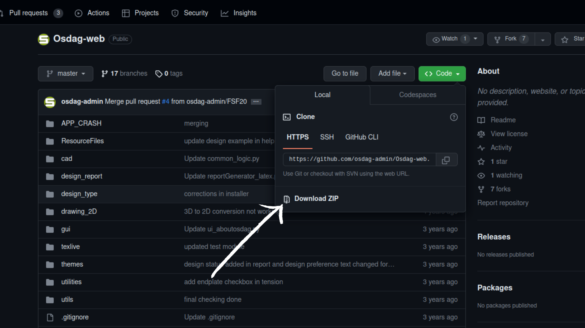

# Installation of Osdag-Web Application

The Osdag-Web application uses 'Conda' environment which contains all the dependencies. To first download these, visit the link : [https://osdag.fossee.in/resources/downloads]() and download the ' Installer [Release: 2021-02-15] ' for Ubuntu : 

1. Install both the Installer - Linux and the Installation instructions for Ubuntu files

    


2. After successfull installation, a file with the name `Osdag_ubuntu_installer_v2021.02.a.a12f.tar.gz` will be downloaded in the 'Downloads' folder on your Ubuntu Machine. Open the terminal in the Downloads folder ( `Ctrl+Alt+T` ) and unpack the tar file with the command :

   ```
   tar -xvf Osdag_ubuntu_installer_v2021.02.a.a12f.tar.gz
   ```
3. After unzipping the file, cd into the Osdag Ubuntu installer, open the file 0-README.txt file and follow the instructions given in the file
4. Now you have successfully installed Osdag, texLive and miniconda on your machine. Navigate to 'Desktop'
5. The next step is to clone the Osdag-Web repository on github. There are 2 ways to download the repository :

   * If you already have `git` installed on your machine, then open a new terminal in Desktop ( `Ctrl+Alt+T` ) and run the following command :

     ```
     git clone https://github.com/osdag-admin/Osdag-web.git
     ```
   * If you don't have `git` installed, then visit the Repository link : [https://github.com/osdag-admin/Osdag-web](https://github.com/osdag-admin/Osdag-web) , click on `Code` tab and download the zip file

     
