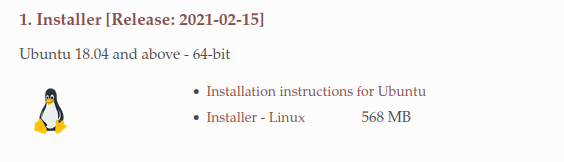
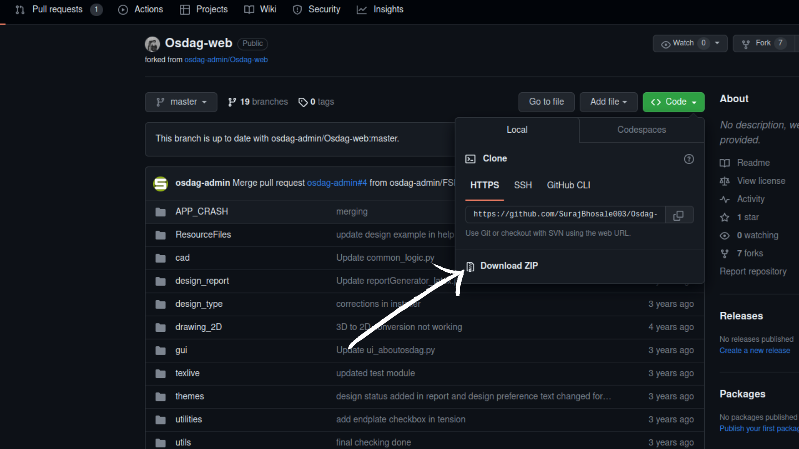
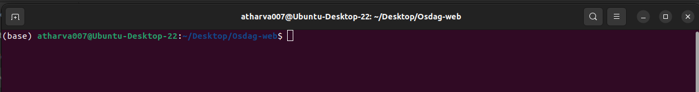

# Installation of Osdag-Web Application

### Software Requirements :

1. Ubuntu LTS 20.04 / 22.04
2. Check if your Ubuntu machine USERNAME is present in the sudoers file or not.

   ```
   sudo -l
   ```

   If the output gives you the username of your Ubuntu machine, then skip this step and proceed with the next step.

   If the output is : `Sorry, user USERNAME may not run sudo on VIRTUAL_MACHINE/UBUNTU_MACHINE`

   Then, you will have to add your Ubuntu username into the sudoers file

   * Obtain the USERNAME

     ```
     whoami
     ```
   * Get into the root and open the file

     ```
     su root
     ```

     ```
     nano /etc/sudoers
     ```
   * Then under the title `# User Priviledge specification` , insert the below line :

     ```
     USERNAME ALL=(ALL:ALL) ALL
     ```

     Replace the text USERNAME with the username that you have obtained by the command `whoami.`

     Save the file (**ctrl+o**) and exit (**ctrl+x**)
   * Exit the root terminal with `ctrl+d`
   * Close the terminal and reopen it (**ctrl+alt+t**)
3. Git : Install Git on Ubuntu. Open the terminal (**ctrl+alt+t**) and run the below commands:

   * Update the Repository

     ```
     sudo apt update
     ```
   * Install Git

     ```
     sudo apt install git
     ```
4. IDE ( **OPTIONAL** ) ( preferrably VSCode ) : Install VSCode with

   ```
   sudo snap install --classic code
   ```
5. Node v16.20.0 : Install Node from NVM by running these commands in the Terminal

   * Install curl before with the command :

     ```
     sudo apt install curl
     ```
   * Node installation commands :

     ```
     curl -o- https://raw.githubusercontent.com/nvm-sh/nvm/v0.39.3/install.sh
     ```

     ```
     curl -o- https://raw.githubusercontent.com/nvm-sh/nvm/v0.39.3/install.sh | bash
     ```

     ```
     source ~/.bashrc
     ```

     ```
     nvm install v16.20.0
     ```
6. Postgres : Install Postgres by running the following commands :

   ```
   sudo sh -c 'echo "deb http://apt.postgresql.org/pub/repos/apt $(lsb_release -cs)-pgdg main" > /etc/apt/sources.list.d/pgdg.list'
   ```

   ```
   wget --quiet -O - https://www.postgresql.org/media/keys/ACCC4CF8.asc | sudo apt-key add -
   ```

   ```
   sudo apt-get update
   ```

   ```
   sudo apt-get -y install postgresql
   ```
7. Freecad : Install freecad with the following commands :

   * Move to the root directory of the Ubuntu machine

     ```
     cd /
     ```

     ```
     sudo apt-get update
     ```
   * Install snapd package manager

     ```
     sudo apt-get install snapd
     ```
   * Install freecad from snap

     ```
     sudo snap install freecad
     ```

### Installation Steps

The Osdag-Web application uses 'Conda' environment which contains all the dependencies. To first download these, visit the link : [https://osdag.fossee.in/resources/downloads](https://osdag.fossee.in/resources/downloads) and download the ' Installer [Release: 2021-02-15] ' for Ubuntu :Install both the Installer - Linux and the Installation instructions for Ubuntu files



1. Follow the instructions in the `Installation instructions` file that you have downloaded. After completing that return back to this installation guide.
2. Install texlive-latex-extra packages. Open the terminal (**ctrl+alt+t**) and run the following command :

   ```
   sudo apt-get update
   ```
   ```
   sudo apt-get install -y texlive-latex-extra
   ```
3. Now you have successfully installed Osdag, texLive and miniconda on your machine. Navigate to 'Desktop'
4. The next step is to clone the Osdag-Web repository on github. There are 2 ways to download the repository :

   * If you already have `git` installed on your machine, then open a new terminal in Desktop (**ctrl+alt+t**) and run the following command :

     ```
     git clone https://github.com/SurajBhosale003/Osdag-web.git
     ```
   * If you don't have `git` installed, then visit the Repository link : [https://github.com/SurajBhosale003/Osdag-web](https://github.com/SurajBhosale003/Osdag-web) , click on `Code` tab and download the zip file

     

     After downloading the zip file, open the terminal and unzip the file :

     ```
     tar -xvf Osdag-Web-master.zip
     ```
     Move the unzipped Osdag-Web-master folder to `Desktop` or wherever you want and rename it to `Osdag-web`
5. Open the Osdag-web folder and open a new terminal there. Make sure you have the conda environment activated. You can know this if there is **(base)** written at the start of the terminal line. If you don't see this, activate the conda environment using :
   

   ```
   conda activate
   ```
6. Create Database and Role in Postgres and Configure it, open the Terminal ( Ctrl + Alt + T ):

   * Enter into the Postgres Terminal

     ```
     sudo -u postgres psql
     ```
   * Create a new role

     ```
     CREATE ROLE osdagdeveloper PASSWORD 'password' SUPERUSER CREATEDB CREATEROLE INHERIT REPLICATION LOGIN;
     ```
   * Create the database

     ```
     CREATE DATABASE "postgres_Intg_osdag" WITH OWNER osdagdeveloper;
     ```
   * Exit from the Postgres terminal

     ```
     \q
     ```
7. Open a terminal (**ctrl+alt+t**) and follow the below steps

   * Enter into the Osdag-web folder which you have cloned

     ```
     cd Desktop/Osdag-web
     ```
   * Switch to **develop** branch

     ```
     git checkout develop
     ```
   * Install requirements.txt packages

     ```
     pip install -r requirements.txt
     ```
   * Configure the Postgres database

     ```
     python populate_database.py
     ```
     ```
     python update_sequences.py
     ```
     ```
     python manage.py migrate
     ```
   * Install the node dependencies

     ```
     cd osdagclient
     npm install
     cd ..
     ```
   * Start the Django server

     ```
     python manage.py runserver 8000
     ```
   * Open another terminal, navigate to root of Osdag-web folder adn run the following commands :

     ```
     cd osdagclient
     ```
     ```
     npm run dev
     ```
8. Now your Server and Client are running. Navigate to [http://localhost:5173/](http://localhost:5173/) on your Browser. Now you can use the application.
